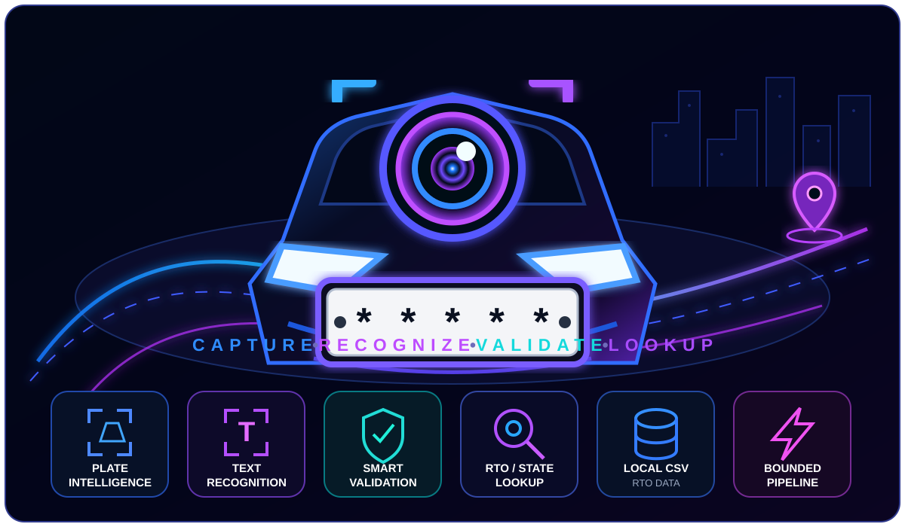
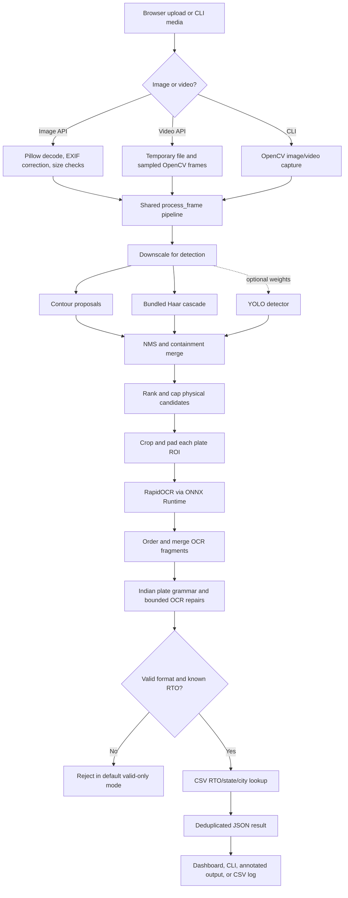

<div align="center">

  

  <h1>Number Plate AI: Local Indian ANPR, OCR &amp; RTO Intelligence</h1>

  <p>
    <strong>Number Plate AI</strong> is a local-first computer-vision application for physical plate detection,
    offline OCR, Indian registration validation, and state/RTO/city lookup.<br />
    Built with FastAPI, OpenCV, RapidOCR, ONNX Runtime, and a local CSV — with no external OCR API.
  </p>

  <p>
    
    
    
    
    
    
    
  </p>

  <p>
    <a href="https://number-plate-detection-using-computer.onrender.com"><strong>Live Application</strong></a> ·
    <a href="https://number-plate-detection-using-computer.onrender.com/health"><strong>API Health</strong></a> ·
    <a href="#installation"><strong>Quick Start</strong></a> ·
    <a href="#api"><strong>API Reference</strong></a> ·
    <a href="#project-structure"><strong>Project Structure</strong></a>
  </p>

  <sub>Last updated: 2026-08-22</sub>

  <br /><br />

  <a href="#-what-is-number-plate-ai">🔎 What is it?</a> ·
  <a href="#installation">⚡ Quick Start</a> ·
  <a href="#architecture">🏗️ Architecture</a> ·
  <a href="#how-the-pipeline-works">⚙️ Pipeline</a> ·
  <a href="#technology-stack">🧰 Tech Stack</a> ·
  <a href="#command-line">💻 CLI</a><br />
  <a href="#api">🔌 API</a> ·
  <a href="#configuration">⚙️ Configuration</a> ·
  <a href="#testing">✅ Testing</a> ·
  <a href="#render-deployment">🚀 Deployment</a> ·
  <a href="#privacy-and-security">🔒 Privacy</a> ·
  <a href="#future-scope">🔭 Future Scope</a>

</div>

<br />

<p align="center">
  
</p>

## 🔎 What is Number Plate AI?

Number Plate AI is a practical, local-first **Automatic Number Plate Recognition (ANPR)** application for Indian vehicle registrations. It accepts images and videos, locates physical plate regions, reads registration text with offline OCR, validates supported Indian plate formats, and maps recognized RTO prefixes to state and city data from a local CSV.

The browser dashboard, API, OCR pipeline, RTO lookup, and static frontend run in **one Python process**. The command-line interface reuses the same core inference function, so web and CLI behavior do not drift into separate implementations.

<table>
  <tr>
    <td align="center"><strong>🖼️ Images</strong><br />JPG · JPEG · PNG · BMP · WebP</td>
    <td align="center"><strong>🎞️ Videos</strong><br />MP4 · AVI · MOV · MKV · WebM</td>
    <td align="center"><strong>🧠 OCR</strong><br />RapidOCR + ONNX Runtime</td>
  </tr>
  <tr>
    <td align="center"><strong>🎯 Detection</strong><br />Contours + Haar + optional YOLO</td>
    <td align="center"><strong>🗺️ Lookup</strong><br />1,146 RTO CSV records</td>
    <td align="center"><strong>🚀 Delivery</strong><br />Local CLI/web + one Render service</td>
  </tr>
</table>

## ✨ Highlights

- Image support: JPG, JPEG, PNG, BMP, and WebP.
- Video support: MP4, AVI, MOV, MKV, and WebM.
- Physical plate proposals from OpenCV contours and a bundled Haar cascade.
- Optional YOLO detector integration when compatible weights and Ultralytics are supplied.
- Local OCR with RapidOCR and ONNX Runtime; no external OCR API is required.
- One-line and multi-line OCR fragments are ordered and combined before validation.
- Indian standard, Bharat-series, and defence registration parsing.
- State, RTO, and city lookup from a tracked 1,146-row CSV covering 38 state/UT code values.
- Same shared detection pipeline for the web API and command-line interface.
- Integrated frontend with searchable RTO data and browser-local detection history.
- One-service Render Blueprint plus a canonical local launcher: `python main.py`.

## Important scope

This is a practical computer-vision project, not an official government registry or a guaranteed identification system. Recognition can fail on blurred, skewed, distant, obstructed, or unusual plates. The repository contains no trained YOLO weights, so the default detector is contour + Haar. The exact RapidOCR model files bundled by its dependency are not selected or versioned by this repository.

## Architecture


## How the pipeline works

### 1. Input and safety checks

The browser sends a multipart `file` to `POST /detect`. The API reads at most `MAX_UPLOAD_BYTES + 1`, rejects empty or unsupported files, and returns HTTP 413 for an oversized upload.

Images are decoded with Pillow rather than `cv2.imdecode`. Pillow checks decoded dimensions, applies EXIF orientation, converts to RGB, and supports the safe WebP path used by the hosted service. OpenCV then converts the image to BGR. Uploaded videos are written to a temporary file because `cv2.VideoCapture` expects a path or device-like source; cleanup runs in a `finally` block.

### 2. Plate localization

`PlateDetector` optionally downsizes the frame to an 800-pixel longest edge and restores output boxes to original coordinates afterward. It gathers candidates from:

1. **Contours:** bilateral filtering, Canny edges, morphological closing, contour extraction, geometry filters, and a contrast check.
2. **Haar cascade:** the bundled `haarcascade_russian_plate_number.xml` asset through OpenCV's `CascadeClassifier`.
3. **YOLO (optional):** used only if `backend/models/plate_yolo.pt` exists and the optional `ultralytics` package can load it.

Overlapping proposals are merged with Intersection over Union (IoU) and containment-based non-maximum suppression. In normal mode, OCR runs only on candidates independently supported by physical plate geometry. This reduces latency and prevents unrelated vehicle text from becoming a result.

### 3. OCR

Each candidate receives a small padding margin and is passed to `OCREngine`. Preprocessing variants are generated lazily:

1. original color crop;
2. grayscale crop, upscaled to at least 96 pixels high when needed;
3. CLAHE-enhanced grayscale crop.

The production dependency is **RapidOCR**, which performs local neural OCR through **ONNX Runtime**. The local default engine order also knows about EasyOCR, Tesseract, and a basic template matcher, but EasyOCR and Tesseract are not installed by the production requirements. Render explicitly configures `OCR_ENGINE_ORDER=rapidocr`.

OCR fragments are arranged by visual row and left-to-right position. Neighboring fragments are merged with overlap removal so multi-line or split readings can become one registration string.

### 4. Validation and repair

`backend/plate_text.py` removes punctuation and whitespace, then checks project-defined grammars for standard Indian registrations, Bharat-series registrations, and defence registrations. Ambiguous OCR characters are repaired only in positions where the expected format requires a letter or digit. The number of corrections remains visible in the response.

Default valid-only mode rejects candidates when text is unreadable, does not match a supported grammar, requires too many corrections, lacks physical geometry, or has an RTO prefix absent from the dataset. No plate text or confidence is invented.

### 5. RTO lookup and output

`RTOLookupEngine` loads `India_RTO_Registration_Dataset_New.csv` at startup, validates required columns, normalizes RTO codes, rejects duplicate prefixes, and registers known state codes with the parser. Lookup results distinguish:

- `exact`: state + RTO prefix found;
- `state`: state recognized but RTO number absent;
- `national`: Bharat-series or defence registration;
- `none`: no reliable mapping.

The default API reports only exact or national results. Confidence comes from the OCR engine, an optional YOLO probability, or `null`; contour/Haar scores are never fabricated.

## Technology stack

Only direct versions declared by this repository are listed. Transitive dependencies are not locked.

| Technology | Version | Role |
|---|---:|---|
| Python | 3.12.3 target | Application language and configured Render runtime |
| FastAPI | 0.121.2 | API routes, uploads, lifespan, and JSON responses |
| Uvicorn | 0.41.0 | ASGI server for FastAPI |
| python-multipart | 0.0.20 | Multipart file upload parsing |
| OpenCV (`opencv-python`) | 5.0.0.93 | Image transforms, contour/Haar detection, video I/O, drawing, and template matching |
| NumPy | 2.5.2 | Image arrays, numeric operations, statistics, and OCR ordering |
| Pillow | 12.1.0 | Image validation/decoding, EXIF orientation, and WebP-safe upload handling |
| RapidOCR ONNX Runtime | 1.2.3 | Primary offline OCR wrapper |
| ONNX Runtime | 1.28.0 | CPU inference runtime used by RapidOCR |
| Pytest | 9.0.1 | Development test runner |
| HTTPX | 0.28.1 | HTTP client used by FastAPI's test client stack |
| HTML/CSS/JavaScript | browser-provided | Build-free dashboard, uploads, results, search, theme, and local history |
| Render Blueprint | repository configuration | Optional deployment as one Python web service |

### Optional components

| Component | Version shown in repository | Current status |
|---|---:|---|
| EasyOCR | 1.7.2 | Commented optional dependency; not required |
| pytesseract | 0.3.13 | Commented optional wrapper; also requires a system Tesseract binary |
| Ultralytics | 8.3.0 | Commented optional dependency; requires user-supplied trained weights |
| YOLO model | Not specified | No model weights are included or active |

The example training command mentions `yolov8n.pt`, but that is only an example starting checkpoint in `backend/dataset/data.yaml`; it does not prove that a YOLOv8n model was trained or deployed.

## Requirements

- Python 3.12 (the repository pins 3.12.3).
- A clean virtual environment is strongly recommended.
- Enough memory to load OpenCV, ONNX Runtime, and RapidOCR models.
- Optional: FFmpeg-compatible codecs available to OpenCV for particular video formats.
- Optional: a webcam for CLI capture with `--video 0`.

## Installation

### Windows PowerShell

```powershell
py -3.12 -m venv .venv
.\.venv\Scripts\Activate.ps1
python -m pip install -r requirements.txt
python main.py
```

### Linux or macOS

```bash
python3.12 -m venv .venv
source .venv/bin/activate
python -m pip install -r requirements.txt
python main.py
```

Open <http://127.0.0.1:8000/>. Keep the terminal running and press `Ctrl+C` to stop the service. `run-local.ps1` is an optional Windows helper that creates `.venv`, installs missing dependencies, checks port 8000, and starts the same launcher.

## Usage

### Web dashboard

1. Start the application with `python main.py`.
2. Open `http://127.0.0.1:8000/` instead of opening `frontend/index.html` directly.
3. Select an image or video and choose **Run Detection**.
4. Review the recognized registration, confidence provenance, state, RTO code, and city.
5. Use **Clear History** to remove browser-local detection history.

The dashboard stores at most 200 result summaries in browser `localStorage`; there is no server-side history database.

### Command line

```powershell
# Image result in the terminal
python main.py --image samples/demo_plate.jpg

# JSON output
python main.py --image samples/demo_plate.jpg --json

# Save an annotated image
python main.py --image samples/demo_plate.jpg --output output/demo_plate.jpg

# Process every 30th video frame and save an annotated video
python main.py --video clip.mp4 --stride 30 --output output/annotated.mp4

# Append recognized results to a CSV
python main.py --video clip.mp4 --csv output/detections.csv

# Webcam index 0 with a local preview window
python main.py --video 0 --show
```

The CLI processes a complete video stream until it ends or the preview is stopped. The HTTP video endpoint instead applies frame-count and time limits to keep hosted requests bounded.
## API

| Method | Path | Purpose |
|---|---|---|
| `GET` | `/health` | App version, OCR availability, detector sources, dataset statistics, and upload limit |
| `GET` | `/rto-dataset` | All validated RTO lookup rows for the dashboard |
| `POST` | `/detect` | Multipart image/video detection through form field `file` |

### Synthetic image response example

```json
{
  "media_type": "image",
  "image_size": {"width": 880, "height": 540},
  "plate_count": 1,
  "plates": [
    {
      "box": [248, 297, 386, 112],
      "text": "MH12DE1433",
      "is_valid_format": true,
      "plate_format": "standard",
      "ocr_corrections": 0,
      "raw_ocr_text": "MH12DE1433",
      "confidence": 87.3,
      "confidence_basis": "ocr:rapidocr",
      "ocr_engine": "rapidocr",
      "detection_source": "contour",
      "detector_confidence": null,
      "state_name": "Maharashtra",
      "state_code": "MH",
      "full_rto_code": "MH-12",
      "city": "Pune",
      "rto_match_level": "exact"
    }
  ]
}
```

Video responses additionally include `frames_scanned`, `frame_stride`, `processing_limited`, and `fps`. Each recognized plate includes `frame_index`, `timestamp_seconds`, and `times_seen`.

Common errors are HTTP 400 for empty, unsupported, corrupt, or undecodable media and HTTP 413 for encoded uploads or decoded images beyond configured limits.

## Configuration

Configuration is read from environment variables when modules are imported; restart the process after changing values.

| Variable | Default | Purpose |
|---|---:|---|
| `RTO_DATASET_PATH` | root master CSV | Override the RTO CSV path |
| `FRONTEND_DIR` | `frontend/` | Static dashboard directory |
| `YOLO_WEIGHTS_PATH` | `backend/models/plate_yolo.pt` | Optional trained detector weights |
| `MAX_UPLOAD_BYTES` | `5242880` | Maximum encoded HTTP upload size |
| `MAX_IMAGE_PIXELS` | `12000000` | Maximum decoded image pixel count |
| `DETECTION_MAX_EDGE` | `800` | Longest edge used during localization |
| `MIN_PLATE_ASPECT` | `1.6` | Minimum single-line plate aspect ratio |
| `MAX_PLATE_ASPECT` | `8.0` | Maximum single-line plate aspect ratio |
| `MIN_PLATE_AREA_RATIO` | `0.00015` | Minimum candidate area relative to frame |
| `MAX_PLATE_AREA_RATIO` | `0.45` | Maximum candidate area relative to frame |
| `MIN_PLATE_WIDTH_PX` | `48` | Minimum candidate width after detector scaling |
| `MIN_PLATE_HEIGHT_PX` | `16` | Minimum candidate height after detector scaling |
| `NMS_IOU_THRESHOLD` | `0.3` | Overlap threshold for candidate merging |
| `ROI_PAD_RATIO` | `0.06` | Padding around each OCR crop |
| `MAX_OCR_CANDIDATES` | `6` local / `3` Render-aware | Maximum OCR crops per frame |
| `ONLY_VALID_PLATES` | `1` | Reject unconfirmed or invalid plate results |
| `REQUIRE_KNOWN_RTO` | `1` | Require exact CSV RTO match except national formats |
| `MAX_OCR_CORRECTIONS` | `2` | Maximum format-guided character repairs |
| `OCR_MIN_CONFIDENCE` | `0.30` | Minimum OCR fragment score on a 0-1 scale |
| `OCR_ENGINE_ORDER` | `rapidocr,easyocr,tesseract,template` | Local engine preference order |
| `VIDEO_FRAME_STRIDE` | `30` | HTTP video distance between sampled frames |
| `VIDEO_MAX_FRAMES_SCANNED` | `12` | Maximum HTTP video frames sampled |
| `PROCESSING_TIMEOUT_SECONDS` | `75` | HTTP video time budget |
| `LOG_LEVEL` | `INFO` | Python logging level |

## RTO dataset

`India_RTO_Registration_Dataset_New.csv` is the runtime lookup source. Its confirmed structure is:

```text
state_code,state_name,rto_code,full_rto_code,registration_prefix,city
```

The current file contains 1,146 usable rows and 38 distinct state/UT code values. Tests check required columns, non-empty fields, unique prefixes, consistent code formatting, and representative lookups. It is a reference table—not training data.

The repository does not document the CSV's authoritative source, license, update date, or independent verification process. Treat mappings as project data and verify them against an authoritative source before high-impact use.

## Optional YOLO integration

YOLO is **not active in the current repository**: no `.pt` weights are included, and Ultralytics is not part of production requirements. `backend/dataset/data.yaml` defines an expected one-class (`number_plate`) training layout. After collecting and licensing your own labeled data, a possible workflow is:

```bash
python -m pip install ultralytics==8.3.0
yolo task=detect mode=train model=yolov8n.pt data=backend/dataset/data.yaml epochs=50 imgsz=640
```

Copy the resulting `best.pt` to `backend/models/plate_yolo.pt` or set `YOLO_WEIGHTS_PATH`. Confirm `/health` lists `yolo` before claiming that a learned detector is active. Training data, model accuracy, selected checkpoint, and final model version cannot be determined from this repository because they are not present.

## Testing

Install development dependencies and run the complete suite:

```bash
python -m pip install -r requirements-dev.txt
python -m pytest tests -q
```

The current suite contains 107 passing tests in the audited workspace. Coverage includes upload validation, WebP decoding, images and videos, physical localization, NMS, multi-plate behavior, OCR grammar/repair, confidence provenance, RTO integrity, and end-to-end synthetic registrations. Neural end-to-end tests skip when no neural OCR engine is available.

A passing synthetic suite is not an accuracy benchmark. The repository contains no precision, recall, F1, latency, load, or cross-device benchmark dataset.

## Render deployment

`render.yaml` describes one desired Python web service with the frontend, API, OCR, cascade, and CSV together:

```text
Build:  python -m pip install --no-cache-dir -r requirements.txt
Start:  python main.py --host 0.0.0.0 --port $PORT
Health: /health
Python: 3.12.3
```

Create a Render Blueprint from the repository and review its settings before applying it. The file currently requests Render's `free` plan in the Singapore region and sets conservative CPU/memory controls. This describes repository configuration only; it does not prove current service availability, deployed package versions, or future hosting prices. Render plan availability and pricing can change.

The public API has no authentication or rate limiting in this codebase. Add both before exposing a production or sensitive workload.

## Project structure

```text
.
├── main.py                         # Canonical server launcher and media CLI
├── requirements.txt               # Includes production dependency manifest
├── requirements-dev.txt           # Pytest and HTTPX test dependencies
├── render.yaml                    # One-service Render Blueprint
├── run-local.ps1                  # Optional Windows setup/launch helper
├── India_RTO_Registration_Dataset_New.csv
├── backend/
│   ├── __init__.py                # Application version (2.1.0)
│   ├── config.py                  # Environment-driven configuration
│   ├── main.py                    # FastAPI routes and shared inference flow
│   ├── detector.py                # Contour, Haar, optional YOLO, and NMS
│   ├── ocr_engine.py              # OCR engines and preprocessing chain
│   ├── plate_text.py              # Grammar, repairs, and fragment merging
│   ├── rto_lookup.py              # CSV validation and prefix lookup
│   ├── requirements.txt           # Exact direct production pins
│   ├── cascades/                  # Bundled Haar cascade asset
│   └── dataset/data.yaml          # Optional YOLO training layout
├── frontend/
│   ├── index.html                 # Integrated dashboard markup
│   ├── style.css                  # Responsive dashboard styles
│   └── script.js                  # Uploads, rendering, search, and history
├── samples/
│   └── demo_plate.jpg             # Demonstration media asset
├── tests/
│   ├── conftest.py
│   ├── test_api.py
│   ├── test_detector.py
│   ├── test_plate_text.py
│   └── test_rto.py
└── output/                         # Generated annotations/logs; Git-ignored
```
## Privacy and security

Vehicle registrations and timestamps can be sensitive identifiers. Use the project responsibly and follow applicable law.

- **Local mode:** OCR and lookup run in your Python process; no external OCR API is called.
- **Hosted mode:** uploaded media is transmitted to the server operator (for example, Render), even though OCR itself remains local to that server.
- The browser stores up to 200 detection summaries in `localStorage` until **Clear History** is used.
- CLI CSV output may contain timestamps, plate text, source paths, and location mappings. Generated outputs are Git-ignored by default.
- Successful OCR text is currently written to application logs at INFO level. Review log retention/redaction before handling real identifiers.
- Uploaded videos use temporary files with best-effort cleanup; an abrupt process failure can interrupt cleanup.
- `/detect` has upload/pixel bounds and a global inference lock, but no authentication, authorization, rate limiting, malware scanning, or per-user isolation.
- Do not commit private media, detection logs, trained weights without provenance, credentials, or environment files.

## Known limitations

- Contour/Haar localization is sensitive to lighting, plate borders, viewing angle, clutter, blur, and resolution.
- No trained YOLO weights are shipped, so a learned plate detector is not active by default.
- RapidOCR's exact bundled model names, model versions, training data, and measured project accuracy are not specified here.
- Multi-line handling combines OCR fragments but is not a dedicated multi-line plate model.
- Default valid-only mode drops unreadable/invalid candidates instead of returning guessed text.
- The RTO CSV can become stale and has no documented upstream provenance or license in this repository.
- The browser has upload-based image/video detection but no live camera capture. The CLI can read a numeric webcam source.
- The API serializes inference in one process to control native-memory pressure; this limits throughput.
- HTTP video processing samples frames and can miss plates that appear only between sampled frames.
- Video codec support depends on the OpenCV/runtime build.
- There is no database, user account system, access control, queue, distributed worker, or model monitoring.

## Future scope

Evidence-based next improvements include:

1. Collect a licensed, representative plate dataset and train/evaluate a detector with documented precision, recall, and F1.
2. Add and version a production YOLO/alternative detector only after recording weights, training data, license, and benchmark results.
3. Benchmark OCR alternatives and fine-tune a plate-specific recognizer for difficult fonts, perspective, and multi-line layouts.
4. Add perspective correction, motion deblurring, super-resolution experiments, and tracking across video frames.
5. Introduce authentication, rate limiting, request queues, worker isolation, and privacy-aware log redaction.
6. Replace process-local inference with scalable CPU/GPU workers and autoscaling when measured traffic requires it.
7. Add browser camera capture with explicit permission and retention controls.
8. Add CI, code coverage, typed schemas, structured observability, model/data cards, and reproducible dependency locking.
9. Document and automate the authoritative source, license, update date, and validation process for RTO data.
10. Add an approved software license, contribution guide, security policy, and responsible-use policy.

## Provenance and licensing status

No repository-level `LICENSE` file is present. Public visibility alone does not grant reuse, modification, or redistribution rights; add an approved license before describing the repository as open source. The provenance/license of the bundled Haar XML, RTO CSV, sample image, optional training data, and any future model weights should also be documented before redistribution or commercial use.

---

Built as a local-first educational ANPR pipeline using FastAPI, OpenCV, RapidOCR, ONNX Runtime, and a CSV lookup layer.